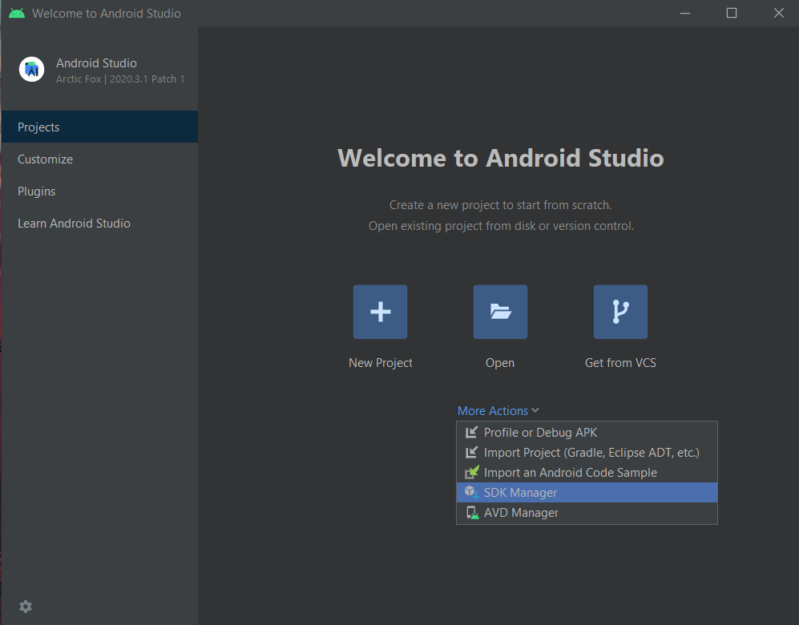
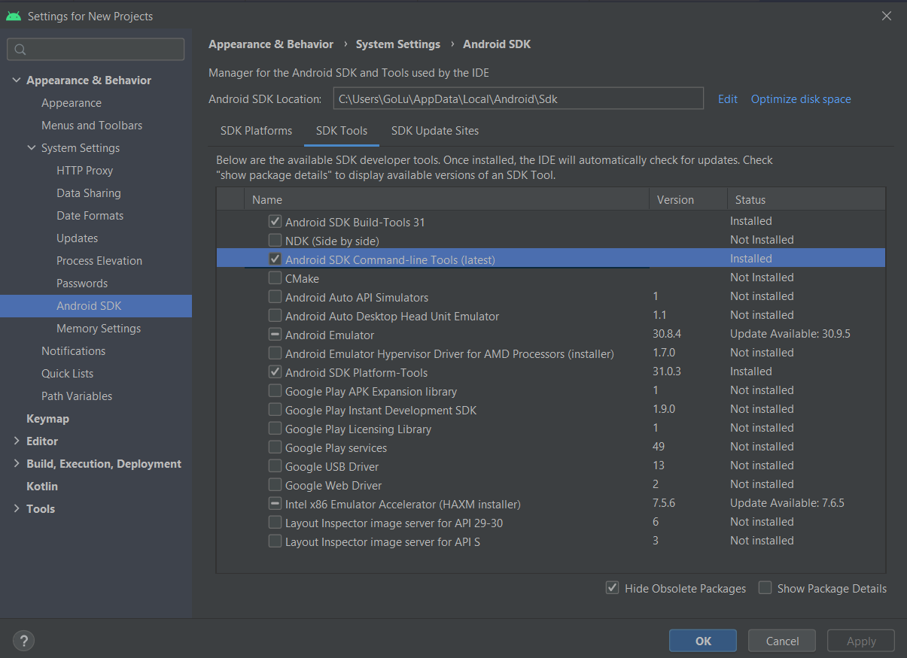
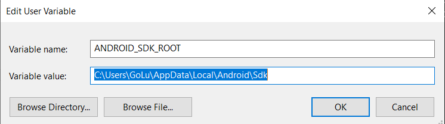
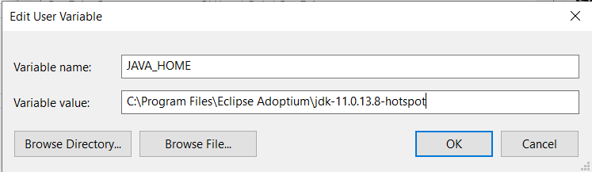
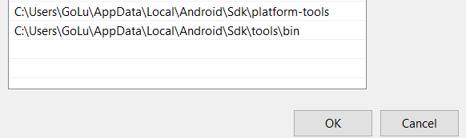
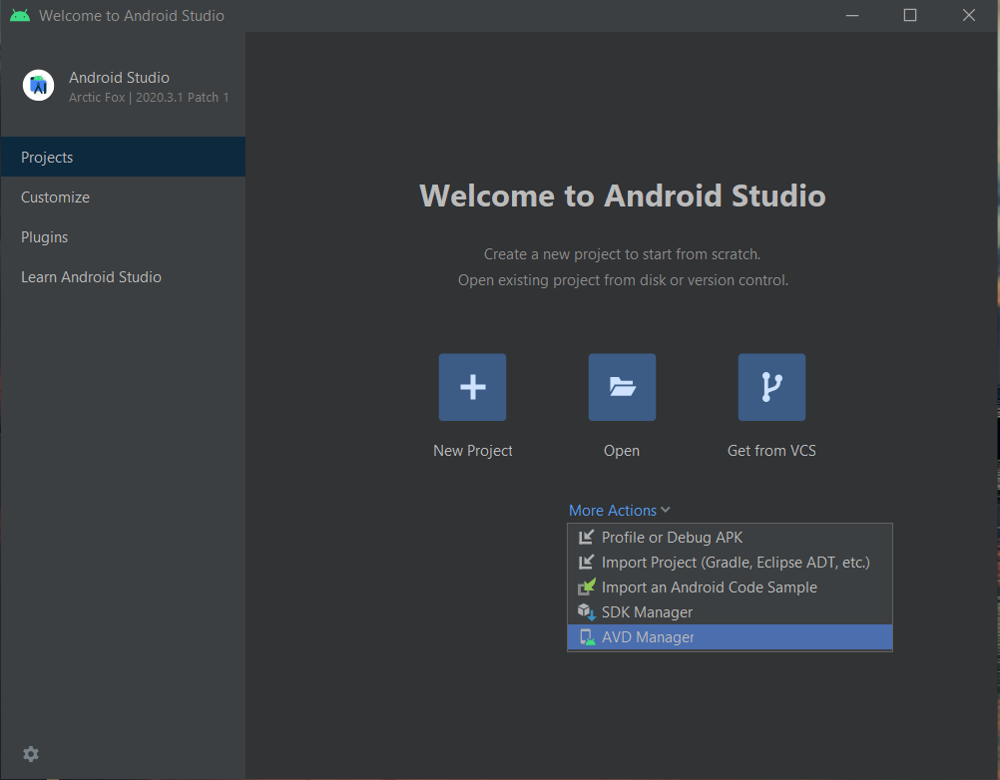
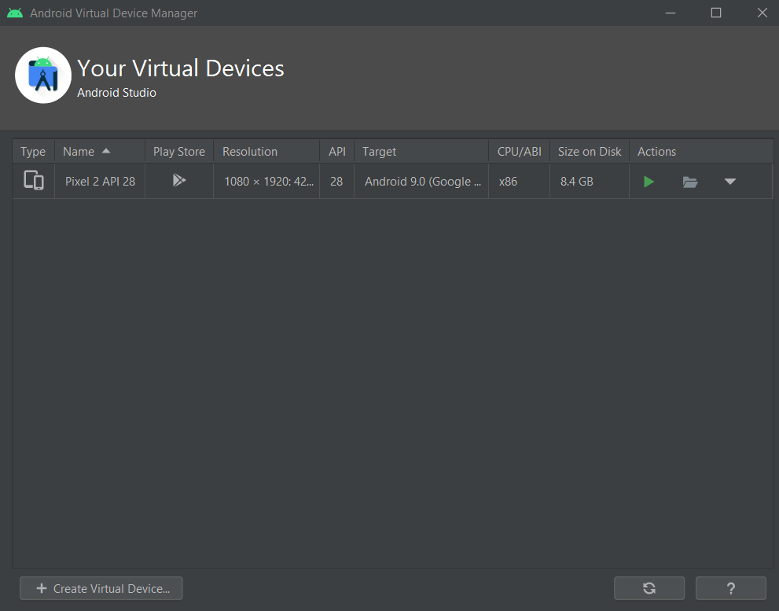

# SUPER NATIVE

**PURPOSE :** Testing

# SETUP REACT NATIVE APP

## Requirements

**1.** **[Node.js](https://nodejs.org/en/)** (Click on the link to download)

**2.** Text Editor (Preferred **[Visual Studio Code](https://code.visualstudio.com/download)**
OR **[Notepad++](https://notepad-plus-plus.org/downloads/)**
OR **[PhpStorm](https://www.jetbrains.com/phpstorm/download/#section=windows)**
OR **[Atom](https://atom.io/)** or any other text editor)

**3.** **[Android Studio](https://developer.android.com/studio)** (Click on the link to download)

**4.** JDK(Java Development Kit) **[JAVA](https://adoptopenjdk.net/)** (download java 11)  (download java according to
gradle support, I am just providing the current version of java which supports gradle right now, If you are reading this
file then first search the latest version of java which support gradle )

## To Setup The App

Run following commands in window terminal

```bash
    npm i -g create-react-app
```

```bash
    npm i -g create-react-native-app
```

```bash
    npm i -g react-native-cli
```

## Next Step

Open Android Studio and follow the step which showing in image

1) Click on SDK manager
   
2) Download third point of the list
   

## Setup Environment Variables

Image is given below to setup environment variables


**NOTE :** Here I am using Java Eclipse, you can use other Oracle java



**NOTE :** Add this in `PATH` section

```bash
   C:\Users\GoLu\AppData\Local\Android\Sdk\platform-tools
```

```bash 
    C:\Users\GoLu\AppData\Local\Android\Sdk\tools\bin
```



### Create React Native App

```bash
    npx react-native init project_name
```

### Before Executing app do these things

1. if you are using a physical device then
    1. Connect your phone with your system
    2. Open `Developer Tool`
    3. Turn on `USB Debugging`
    4. Run `adb devices` it will show your connected device info


2. If you are using an emulator
    1. Open Android Studio
    2. Click on `AVD Manager`
       
    3. Click play symbol which is below of `Action` word
       
        1. If you cannot see any device their then click on `Create Virtual Device`  and download a device what you
           want.

## Run React Native App

```bash
   npx react-native run-android
```
